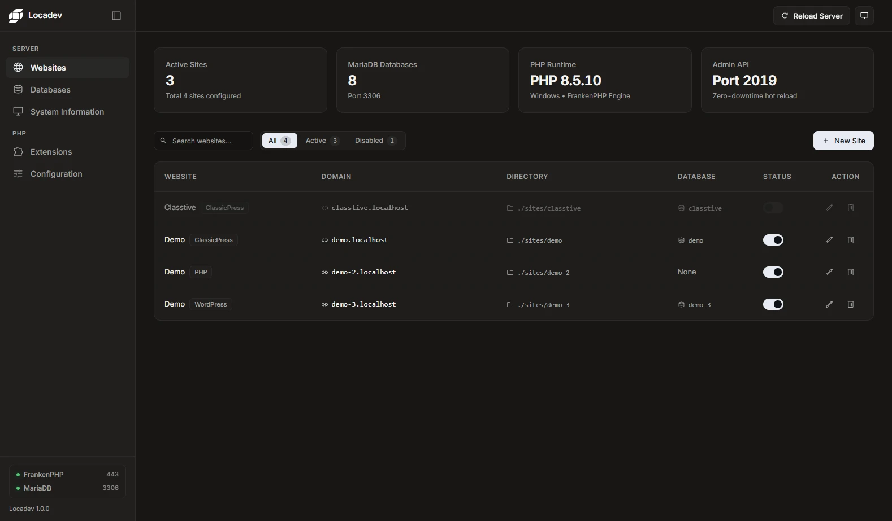

<div align="center">

  <picture>
    <source media="(prefers-color-scheme: dark)" srcset="dashboard/assets/locadev-white.svg">
    
  </picture>

# Locadev

A self-contained local web development environment — FrankenPHP, Caddy & MariaDB — for Windows, Linux, and macOS. No Docker. No WSL. No configuration.

[Report an Issue](https://github.com/bismawy/locadev/issues)


</div>



## Features

- **One Folder, Everything Included:** FrankenPHP + Caddy + PHP and MariaDB bundled in a single directory on Windows; Linux/macOS fetch the matching official static binaries.
- **Automatic Local HTTPS:** Every site gets its own `https://<name>.localhost` domain with TLS auto-provisioned by Caddy's internal CA — no port numbers, no certificate warnings after the first trust.
- **Web Dashboard:** Create, enable/disable, and delete sites visually; create/drop databases; hot-reload Caddy with zero downtime. No terminal required.
- **CMS & Framework Presets:** One click installs ClassicPress or WordPress, or scaffolds a fresh Laravel app via Composer (auto-downloaded, `.env` + `APP_KEY` + migrations included).
- **Background by Design:** Services start hidden, poll their ports until actually ready, and stay out of your taskbar. Stop is graceful (admin API + `mariadb-admin shutdown`), never a hard kill.
- **Cross-Platform CLI:** The same `locadev` command works identically in PowerShell, CMD, Git Bash, zsh, and plain sh.
- **Upgrade-Safe Data:** Re-running the installer upgrades in place — `data/`, `sites/`, and your site registry are never touched.

## Installation

<details open>
<summary><b>Windows</b> (PowerShell)</summary>

```powershell
irm https://raw.githubusercontent.com/bismawy/locadev/main/install.ps1 | iex
```

- Installs to `C:\Users\<you>\Locadev` (override with `$env:LOCADEV_HOME` before running).
- Downloads the binary bundle (FrankenPHP, PHP, MariaDB) for Windows x64.
- Registers `locadev` on your user PATH, starts everything, and opens the dashboard.

</details>

<details>
<summary><b>Linux</b> (x86_64 &amp; aarch64)</summary>

```bash
curl -fsSL https://raw.githubusercontent.com/bismawy/locadev/main/install.sh | bash
```

- Installs to `~/locadev` (override with `LOCADEV_HOME=...`).
- Downloads the official static FrankenPHP build for your architecture.
- Needs `mariadb-server` from your package manager if it isn't already installed (`apt`, `pacman`, `dnf`…).

</details>

<details>
<summary><b>macOS</b> (arm64 &amp; Intel)</summary>

```bash
curl -fsSL https://raw.githubusercontent.com/bismawy/locadev/main/install.sh | bash
```

- Same installer as Linux; downloads the official macOS FrankenPHP build for your architecture.
- Needs MariaDB: `brew install mariadb` (if not installed, Locadev tells you).

</details>

<details>
<summary><b>Manual install</b> (no installer)</summary>

1. Download &amp; extract the repository anywhere (e.g. `D:\Locadev` or `~/locadev`).
2. Add the `bin` folder to your PATH (optional, for the global `locadev` command).
3. Start it:

```cmd
:: Windows
start.bat            (or: bin\locadev.cmd start)
```

```bash
# Linux / macOS
./bin/locadev start  # background (recommended)
```

</details>

## Quick Start

```bash
locadev start     # start everything in the background (default command)
locadev open      # open the dashboard in your browser
```

Then, in the dashboard: **Create Site** → pick a preset (ClassicPress / WordPress / Laravel / blank) → open `https://yoursite.localhost` and finish the setup. The database is created for you.

| Command | What it does |
| :--- | :--- |
| `locadev` / `locadev start` | Start FrankenPHP &amp; MariaDB in the background |
| `locadev stop` | Gracefully stop all services |
| `locadev restart` | Restart all services |
| `locadev reload` | Hot-reload the Caddy config with zero downtime |
| `locadev status` | Check service status &amp; ports |
| `locadev menu` | Interactive control menu |
| `locadev open` | Open the web dashboard in your browser |

## How It Works

<details>
<summary><b>Background operations</b></summary>

- **Start** launches each service *hidden* (PowerShell `Start-Process -WindowStyle Hidden` on Windows, background process on Unix), then polls the port until the service is actually ready (up to 30 s) before reporting `[ONLINE]`.
- **Stop** is graceful: Caddy is stopped via its admin API (`POST /stop`), MariaDB via `mariadb-admin shutdown`, and the process is awaited until fully flushed — force-kill is only a fallback, so no InnoDB crash recovery on the next start.
- **Reload** asks the running Caddy to re-read the Caddyfile with zero downtime — no dropped requests.

</details>

<details>
<summary><b>Directory layout</b></summary>

```text
Locadev/
├── Caddyfile              # global Caddy config (imports per-site blocks)
├── bin/                   # FrankenPHP, PHP, MariaDB, locadev CLI
├── config/
│   ├── my.cnf             # MariaDB settings template
│   ├── sites.json         # site registry used by the dashboard
│   └── sites/*.caddy      # generated per-site Caddy blocks
├── dashboard/             # the PHP web dashboard (https://localhost)
├── data/
│   ├── mariadb/           # database storage (auto-initialized on first run)
│   ├── cms/               # CMS .zip archives (versioned)
│   └── composer/          # composer.phar + Composer package cache
└── sites/                 # your websites — one folder per <name>.localhost
```

</details>

<details>
<summary><b>Security model</b></summary>

```text
default_bind 127.0.0.1 ::1     # Caddy, admin API, and MariaDB: loopback only
```

- The dashboard API has no auth and MariaDB root has no password — this is safe *only* because everything stays on localhost. Do **not** remove the loopback bind unless you add auth.

</details>

<details>
<summary><b>Cross-platform matrix</b></summary>

| Platform | FrankenPHP | MariaDB |
| :--- | :--- | :--- |
| Windows x64 | bundled `bin/frankenphp.exe` | bundled `bin/mariadb/` |
| Linux x86_64 / aarch64 | official static build (installer) | system `mariadbd` |
| macOS (arm64 / Intel) | official static build (installer) | Homebrew MariaDB |

</details>

## Troubleshooting

<details>
<summary>Service didn't start / reports OFFLINE</summary>

```bash
locadev status          # what's online?
locadev restart         # clean slate
```

- MariaDB errors: check `data/mariadb/*.err`.
- FrankenPHP errors: run `./bin/frankenphp run --config Caddyfile` in a terminal to see the output directly.
- On Linux/macOS: is MariaDB installed (`command -v mariadbd`)? Is port 3306 already taken by a system service? A running system MariaDB is detected and reused.

</details>

<details>
<summary>Browser warns about the self-signed certificate</summary>

Certificates are auto-provisioned by Caddy's internal CA for every `*.localhost` domain. Your browser may show a warning on first visit — proceed, or install the local CA:

```bash
bin/frankenphp trust   # Windows/Linux: install the Caddy local CA into the system trust store
```

</details>

<details>
<summary>The <code>locadev</code> command isn't found after installing</summary>

- **Windows:** open a *new* terminal (PATH changes don't affect already-open windows).
- **Linux/macOS:** run `source ~/.zshrc` (or `~/.bashrc`), or open a new terminal — `~/.local/bin` was added on install.

</details>

<details>
<summary>Changing the install location / repo source</summary>

Both installers accept environment overrides before running:

```powershell
$env:LOCADEV_HOME = "D:\Locadev"
$env:LOCADEV_GH    = "you/locadev"
irm https://raw.githubusercontent.com/bismawy/locadev/main/install.ps1 | iex
```

```bash
LOCADEV_HOME=/srv/locadev LOCADEV_GH=you/locadev \
  curl -fsSL https://raw.githubusercontent.com/bismawy/locadev/main/install.sh | bash
```

</details>

## License

Distributed under the **MIT** license.

## Developer

Developed and maintained by [Bisma](https://github.com/bismawy).
